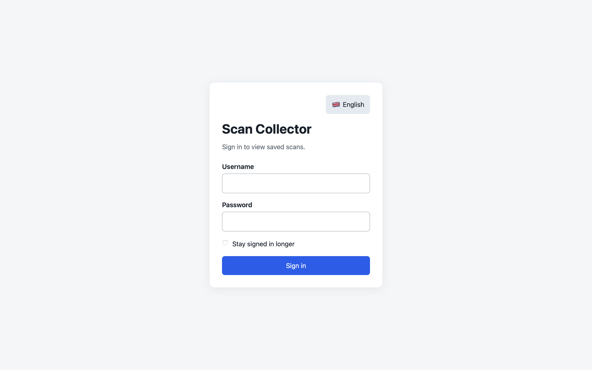
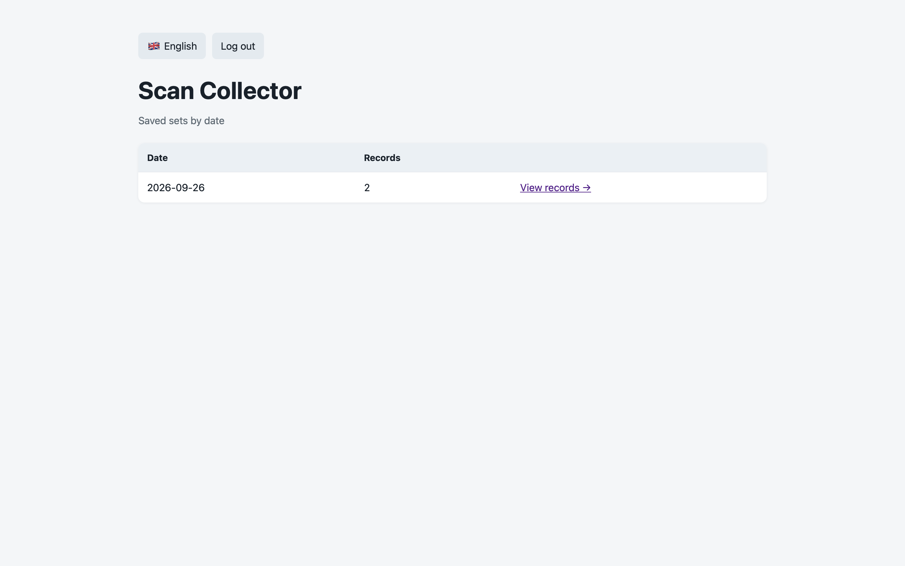
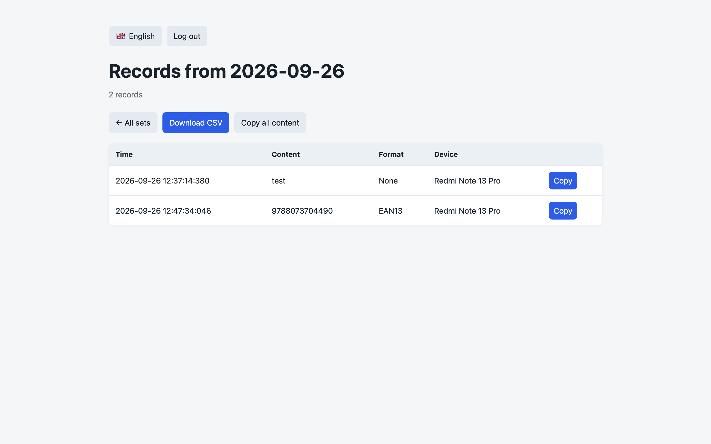

# Scan Collector

Small HTTP server primarily intended as a backend for the Android app [Binary Eye](https://github.com/markusfisch/BinaryEye). It accepts JSON records with `timestamp`, `content`, `format`, and `deviceId` fields, then appends them to daily CSV files. Other clients can use it too, as long as they send requests in the expected JSON format.

Open `http://localhost:8765/` to view saved daily sets and their record counts. Each set has a detail page with per-record and bulk copy buttons, plus a CSV download.

The interface is available in Czech and English. It follows the browser's preferred language by default (Czech for Czech browser settings, English otherwise). Use the flag button to switch languages; the choice is remembered in that browser.

## Screenshots

### Sign in



### Saved sets



### Scanned records



## Run locally

Copy `.env.example` to `.env` next to `compose.yaml`, then set a username and a long, unique password:

```sh
cp .env.example .env
```

The server refuses to start if either value is missing. Keep `.env` private. A login screen protects the dashboard, detail pages, and CSV downloads. Scan submissions to `POST /` do not require authentication so Binary Eye can send them. Use HTTPS through a reverse proxy before exposing the service beyond a trusted local network, because plain HTTP does not encrypt credentials or records. Set `COOKIE_SECURE=true` when serving the site over HTTPS.

`SESSION_TTL` sets the normal login duration (default `8h`). The login screen's extended-session checkbox uses `SESSION_EXTENDED_TTL` (default `720h`, or 30 days). Values use Go duration syntax such as `12h` or `336h`. Session records are stored in `./data/sessions.sqlite3` and survive container restarts; only a hash of each random session token is stored. The session cookie is HTTP-only and uses `SameSite=Lax`.

Start the server:

```sh
docker compose up -d
```

The server listens on port `8765`. CSV files are written to `./data/scan-YYYY-MM-DD.csv` and survive container recreation.

Send a record with:

```sh
curl -X POST http://localhost:8765/ \
  -H 'Content-Type: application/json' \
  -d '{"timestamp":"2026-09-25T12:00:00Z","content":"sample scanned data","format":"QR_CODE","deviceId":"scanner-1"}'
```

Set `PORT` to change the host port. The container writes inside `/data`, mapped to `./data` by Compose. CSV columns are `čas,obsah,formát,zařízení`.

## Run locally without Docker

Install Go 1.25 or newer. Copy the example environment file, set your credentials, then load it into the current shell and run the server directly:

```sh
cp .env.example .env
# Edit .env and set AUTH_USER and AUTH_PASSWORD.
set -a
. ./.env
set +a
export DATA_DIR=./data
go run .
```

The app listens on `http://localhost:8765/` by default. The `./data` directory will contain the daily CSV files and `sessions.sqlite3`. To change the port or session durations, set `PORT`, `SESSION_TTL`, or `SESSION_EXTENDED_TTL` in `.env` before loading it. Set `COOKIE_SECURE=false` for local HTTP.

## Pull the published image

The Compose file uses the published image `ghcr.io/cuchulain/scan-collector:latest` by default. To use another tag, set `IMAGE`:

```sh
IMAGE=ghcr.io/cuchulain/scan-collector:latest docker compose up -d
```

For a private package, authenticate Docker to `ghcr.io` with an account that has package read access before pulling.

## Publish

Pushes to `main`, including merges into `main`, run tests and publish multi-platform `linux/amd64` and `linux/arm64` images to `ghcr.io/cuchulain/scan-collector`, tagged `latest` and with the commit SHA. GitHub Actions uses the built-in `GITHUB_TOKEN`; ensure the repository permits Actions to write packages. The package visibility can be set to private in GitHub Packages.
